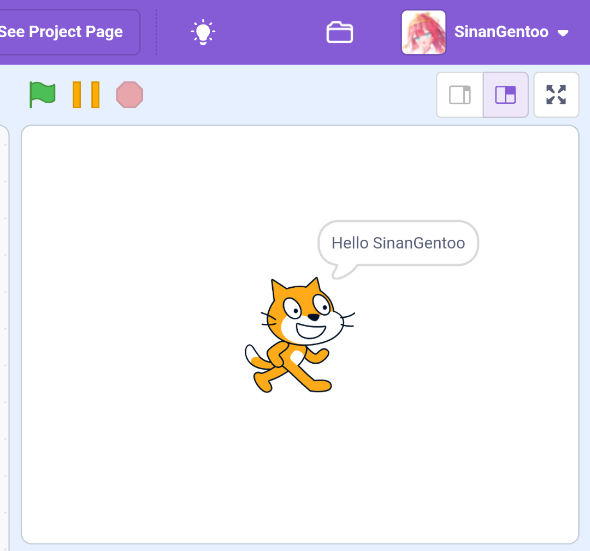

# Userscripts
Userscripts are snippets of JavaScript that are inserted into a web page by the user, usually to add or modify content. For Charlotte, they serve to make changes to the Scratch editor. (Actually, Charlotte is a Userscript too 😂)   
Unlike userscripts in some userscript managers (Eg: TamperMonkey, ViolentMonkey), Charlotte's Userscripts have some different syntax and logic.
## Basic structure
Charlotte's builtin addon's userscripts can be both JavaScript or TypeScript. If you want to reduce potential bugs in your code, we recommend that you use TypeScript. We'll using TypeScript primarily for the next examples.
```ts
// Add license headers or import some type declarations. In most cases, you should not import any files other than types.
import type { AddonCtxWithAPI } from '../api/api';

// The entry function of a userscript, will be called every time the addon is activated.
export default async function ({addon, intl, settings}: AddonCtxWithAPI) {
  // In general, you should put all the logic code that userscripts contains inside this function.
  // ...

  // The disposer function of this userscript, will be called every time the addon is deactivated.
  // If your addon cannot be disabled dynamically, You can remove this function since it's unnecessary.
  return () => {
    // ...
  };
}
```
Here are some explanations of function parameters:
- `addon`: The global context of Charlotte, which contains loader, frontend and global settings. We use this instance to provide interaction between addons (including subsequent access to the API) and event listening.
- `intl`: The instance to provide internationalization support for addons. It is actually provided by ``@formatjs/intl``, you can read its type definition [here](/doc/interfaces/src_core_util_l10n.IntlShape).
- `settings`: The wrapped global settings instance for addons. You can easily get the settings defined by this addon and listen for their changes. (By `settings.get(id)` and `settings.on('change', (id) => {})`)

In addition to the above differences, you can freely add your code logic in functions. It should be noted that all userscripts are run directly on the page, which means you can directly modify the content of the page.

## Using API
Unlike ordinary userscripts, Charlotte wraps some practical methods related to interacting with the Scratch editor to help you develop Scratch addons faster. Now we will use the Charlotte API to write a "Hello World".
::: tip
Since Charlotte API is also provided in the form of addon, you should mark `api` addon as ``required`` to ensure you can use API properly. Although in most cases, the `api` addon is always loaded first.
:::
```ts
import type { AddonCtxWithAPI } from '../api/api';

export default async function ({addon, intl, settings}: AddonCtxWithAPI) {
  // Get Scratch virtual machine instance
  const vm = await addon.api.getVM();
  // Say hello to current user
  const sayHello = () => vm.runtime.emit('SAY', vm.editingTarget, 'say', `Hello ${vm.runtime.ioDevices.userData.getUsername() ?? 'World'}!`);
  // Triggered when project starts
  vm.on('PROJECT_START', sayHello);
  return () => {
    // remove listener before addon deactivated
    vm.off('PROJECT_START', sayHello);
  };
}
```
   
For full API documentation, see [Charlotte API](/doc/interfaces/addons_api_api.CharlotteAPI).
## Listening events
You can use `addon.on()` to listen events emitted by Charlotte or other addons. Charlotte currently lacks a complete list of events, but we have compiled some commonly used events. You may need to read our source code to get full event information.

| Name                     | Description                        | Parameter | Note         |
|--------------------------|------------------------------------|-----------|--------------|
| core.addon.activated     | Emitted when a addon activated     | id        |              |
| core.addon.deactivated   | Emitted when a addon deactivated   | id        |              |
| core.settings.changed    | Emitted when a setting changed     |           |              |
| API.instance.initialized | Emitted when all instances trapped |           | api required |